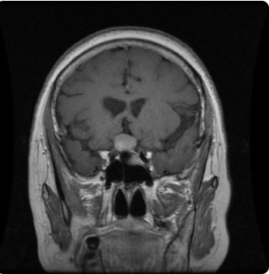
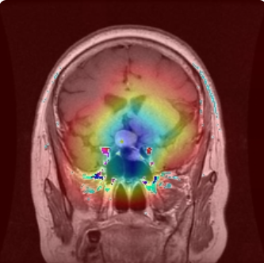

<p align="center">
  
  
  
</p>
# 🧠 Brain Tumor Detection using Deep Learning

An end-to-end deep learning system for detecting brain tumors from MRI images using ResNet50 with transfer learning, deployed as an interactive web application with explainability using Grad-CAM.

---

## 🚀 Key Features

* 🧠 Multi-class tumor classification (4 classes)
* ⚡ Transfer Learning using ResNet50
* 📊 Achieved ~96% validation accuracy
* 🔍 Grad-CAM visualization for model explainability
* 🌐 Streamlit web app for real-time prediction
* 🎯 Confidence score for predictions

---

## 🧪 Classes

* Glioma
* Meningioma
* Pituitary
* No Tumor

---

## 🏗️ Tech Stack

<p align="center">
  
</p>

<p align="center">
  
  
  
</p>

---

## 📊 Model Performance

* Train Accuracy: ~97%
* Validation Accuracy: ~96%

---

## 🖼️ Output Example

| Original MRI               | Grad-CAM (Model Focus)         |
| -------------------------- | ------------------------------ |
|  |  |

---

## ▶️ Run Locally

```bash
# Clone repository
git clone https://github.com/krishnapatel-dev/brain-tumor-detection-cnn.git
cd brain-tumor-detection-cnn

# Install dependencies
pip install -r requirements.txt

# Run application
streamlit run app.py
```

---

## 💡 Key Highlights

* Used transfer learning to leverage pretrained ImageNet features
* Fine-tuned ResNet50 by unfreezing last convolutional block
* Improved generalization using data augmentation
* Reduced training time while achieving high accuracy
* Implemented Grad-CAM for interpretable AI in medical imaging
* Built complete pipeline: training → evaluation → deployment

---

## 📌 Future Improvements

* Cloud deployment (Streamlit Cloud / AWS)
* Add patient history & logging
* Enhance UI/UX further

---

## 👨‍💻 Author

Krishna Patel
